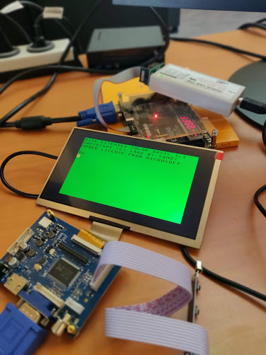

### Tandy Color 2

I tried to recreate the Tandy Color 2 on a Spartan-6 dev board (AX309). There's still a lot to be done (sound, joystick, cassette...) but I don't want to put more efforts into it as it was just a learning project.

po8.v is the top file. Yes I know :grin:, what a strange name...

*Coco 2 running on a AX309 board*